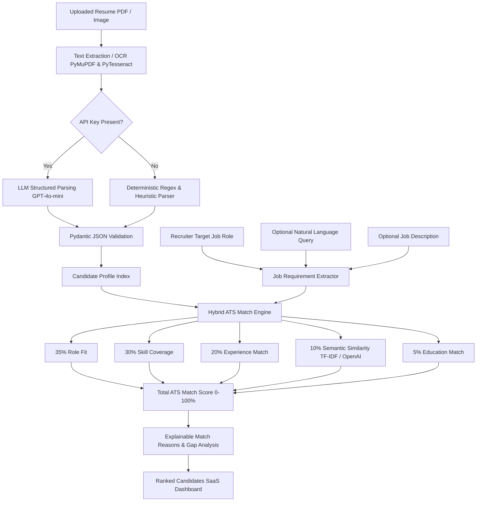

# Resume Intelligence & ATS Candidate Matcher MVP

A production-style, enterprise-grade Resume Parsing and Candidate Matching system designed for high-volume recruitment. Built with Python, Streamlit, PyMuPDF, Pydantic, scikit-learn, and optional OpenAI LLM/Embeddings.

---

## 1. Problem Statement
Growing tech startups receive hundreds of resumes weekly in varying formats (PDFs, scanned documents, multi-column layouts, images). Manually evaluating resumes against open job roles is time-consuming, subjective, and prone to human error.

---

## 2. Product Overview & Key Architectural Principle
**Resume Intelligence ATS** solves this by enforcing a strict two-stage separation:
1. **Stage 1 — Generic Resume Parsing**: Extracts factual information from PDF/Image resumes independently of any job description to create structured candidate profiles.
2. **Stage 2 — Contextual Job Matching**: Matches candidate profiles against a selected **Target Job Role**, optional **Natural Language Query**, and optional **Job Description (JD)** using a deterministic hybrid ATS scoring engine.

> [!IMPORTANT]
> **Key Architecture Principle**:
> **Resume parsing is independent of a job description.** The parser extracts factual information from each resume to create a structured candidate profile. Job-specific suitability is calculated separately. Because suitability is contextual, the recruiter must select a target role. A full JD is optional and provides additional requirements when available.

---

## 3. Architecture Diagram



---

## 4. Standout Features for Enterprise Recruitment

1. **🛡️ Blind Hiring / Anonymization Mode**: Toggle ON to redact names, emails, phones, locations, and personal identifiers from candidate cards and detail views, allowing recruiters to evaluate candidates purely on merit without unconscious bias.
2. **⚔️ Side-by-Side Candidate Comparison**: Compare top candidates in a multi-column matrix with direct skill overlap checkmarks (`✅ Yes` / `❌ No`), experience metrics, and education alignment.
3. **📈 Talent Analytics & Skill Distribution**: Built-in macro insights showing top in-demand skills, candidate experience distributions, and talent pool metrics.
4. **⚙️ Custom Role & Dynamic ATS Weight Configurator**: Recruiters can dynamically adjust scoring component weights (e.g. increase Skill Match to 50%) and add custom job roles to the taxonomy on the fly.
5. **🤖 AI Tailored Technical Interview Question Generator**: Generates 3 targeted technical interview questions per candidate based on their matched skills and identified technical gaps.
6. **📥 Export CSV Candidate Report**: Download ranked candidate scores and profile metadata for HR recordkeeping in 1 click.

---

## 5. Hybrid ATS Scoring Formula

```math
\text{Total Score} = w_1 \times \text{RoleFit} + w_2 \times \text{SkillMatch} + w_3 \times \text{ExpMatch} + w_4 \times \text{SemanticScore} + w_5 \times \text{EduMatch}
```

- **Role Fit (Default 35%)**: Evaluates job title variants and domain keywords against target role taxonomy.
- **Skill Match (Default 30%)**: Required skills carry 70% weight, preferred skills carry 30% weight.
- **Experience Match (Default 20%)**: Smooth penalty curve if experience is below required baseline; 100% score if met/exceeded.
- **Semantic Relevance (Default 10%)**: Cosine similarity between query/JD and candidate vector (OpenAI Embeddings or TF-IDF Vectorizer).
- **Education Match (Default 5%)**: Checks STEM/CS degree alignment.

---

## 6. Installation & Running

```bash
# 1. Install Dependencies
pip install -r requirements.txt

# 2. Generate Sample Resumes
python generate_samples.py

# 3. Run Streamlit Application
streamlit run app.py

# 4. Run Automated Tests
python -m pytest tests/
```

---

## 7. Suggested 2-Minute Interview Demo Flow

1. **Launch App**: Run `streamlit run app.py`.
2. **Load Sample Resumes**: Click **"🚀 Load 6 Sample Resumes (1-Click Demo)"** in the sidebar.
3. **Select Target Role**: Select **`Python Developer`** from the Target Job Role dropdown.
4. **Enter Query**: Type `"Python developers with 3+ years experience and FastAPI"`.
5. **View Candidate Ranking**:
   - Observe **Rahul Sharma (91.4% Match)** ranked **#1**.
   - Expand Rahul's card to show **Explainable Reasons** (`✓ Matched 3/3 required skills`).
   - Click **"🤖 Generate Interview Questions"** to show candidate-tailored questions!
6. **Demonstrate Standout Features**:
   - Toggle **"Blind Hiring Mode"** in sidebar to show PII anonymization.
   - Switch to **"⚔️ Side-by-Side Comparison"** tab to compare Rahul vs Priya.
   - Switch to **"📈 Talent Analytics"** tab to show skill frequency bar charts.
   - Switch to **"⚙️ Custom Roles & ATS Weights"** tab to show dynamic weight sliders.

---

## 8. Critical Interview Q&A Guide

### Q1: Why doesn't resume parsing require a Job Description?
> **Answer**: Resume parsing is factual extraction. A candidate's name, email, skills, and work history exist independently of any job opening. Coupling parsing to a JD creates fragile, redundant processing pipelines. Extracting a reusable candidate profile once allows instant re-matching across hundreds of future job roles.

### Q2: Why is the Target Job Role required for ATS matching?
> **Answer**: Candidate suitability is contextual. There is no universal "80% good resume" score. A candidate with 10 years of Java experience is a 95% match for a Java Lead, but a 30% match for a GenAI Intern. The job role establishes baseline skill, experience, and title expectations.

### Q3: How do you address bias in candidate selection?
> **Answer**: We built an explicit **Blind Hiring Mode** that redacts candidate names, locations, contact info, and gender/age cues from cards and detail views. Matching is calculated deterministically on verifiable skills, experience, and title relevance.

### Q4: How do you handle missing API keys or LLM failures?
> **Answer**: We enforce graceful degradation. If OpenAI API keys are absent or fail, the system falls back to deterministic regex extractors for profile parsing and a `scikit-learn` TF-IDF vectorizer for semantic matching. The application never crashes due to missing credentials.
